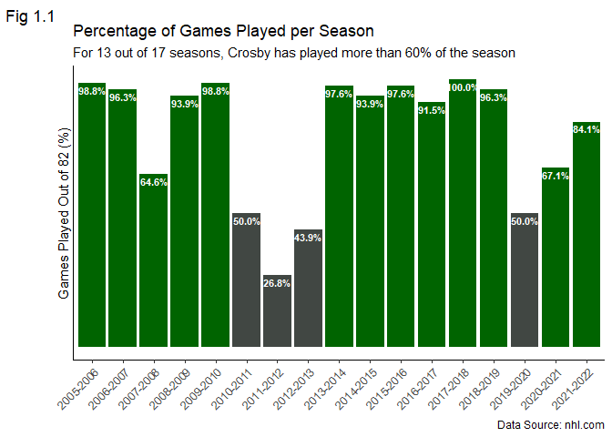
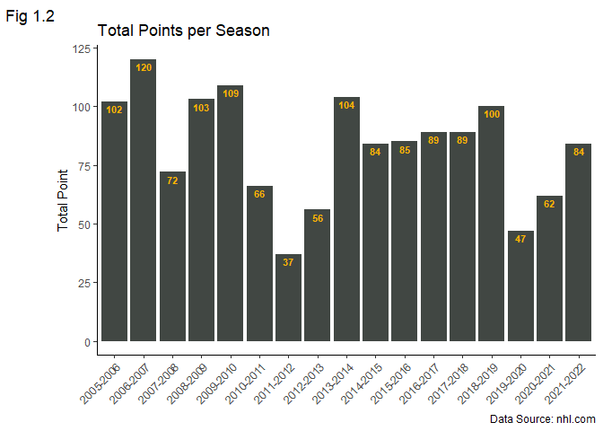
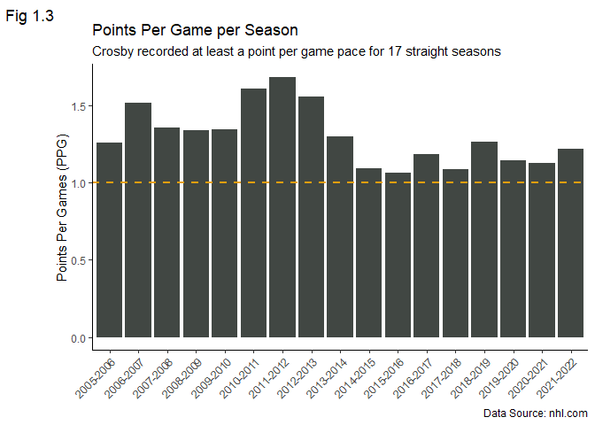
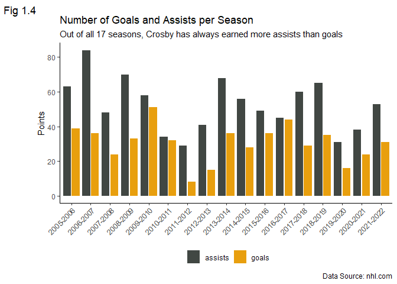
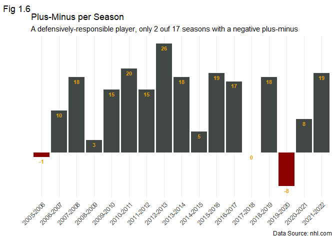
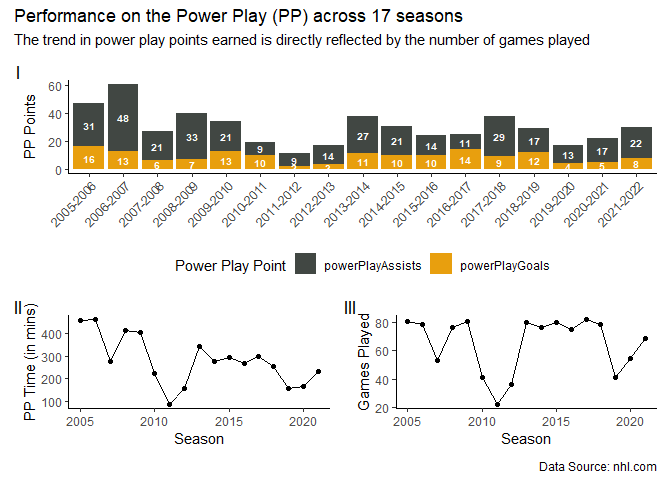

Data Strorytelling of Sidney Crosby’s NHL Career (2005-Present)
================
Saheba Tegally
2022-09-03

## Introduction

This is an exploratory data analysis project of Sidney Crosby’s NHL
career starting 2005 to the latest 2021-2022 NHL season.

### Who is Sidney Crosby?

Sidney Crosby is a Canadian ice hockey player who plays Centre in the
National Hockey League (NHL) and the Captain of the Pittsburgh Penguins.
Born in Nova Scotia, Canada, he was drafted First overall in the 2005
NHL Entry Draft by the Pittsburgh Penguins with a lot of hype around him
as “The Next One”. He has many achievements and accolades to his name.
Most notably, he is a three times NHL Stanley Cup Champion and two times
Olympic Gold Winner.

### Why I chose Sidney Crosby?

Sidney Crosby is the player that got me hooked onto hockey. My first
memorable hockey moment is when I was following the 2010 Vancouver
Winter Olympics and watched Sidney Crosby live on TV scoring the goal in
overtime that won Team Canada Gold for Men Hockey.

### What to expect

We will look at his overall performance throughout the 17 regular
seasons he has played in the NHL so far. We will not look at his
performance in the NHL Playoffs due to the complexity of the playoffs
and taking into consideration that there are years when the Pittsburgh
Penguins either missed the playoffs (albeit rare) or did not make it far
into the playoffs.

### Goal of this project

The goal of this project is to get an overall look at Sidney Crosby’s
NHL career through the lens of data. There are many other great hockey
players out there and the point of this project is not to argue or
emphasize the greatness of Sidney Crosby over other players. Thus, no
comparison of Sidney Crosby to any specific player will be made.

``` r
library(dplyr)
library(tidyr)
library(ggplot2)
library(lubridate)
library(stringr)
library(rmarkdown)
library(here)
library(patchwork)
```

``` r
# get the working directory of this R project
directory <- here()
games_reg = read.csv(file = paste0(directory,"/data/games_regular.csv"), header = TRUE)
```

``` r
nhl_games_reg <- games_reg %>% 
                 # only look at games played in NHL
                 filter(team.name == "Pittsburgh Penguins") %>%
                 # select all statistics related to NHL games
                 select(season:plusMinus) %>%
                 # use only the year the season begins in for season to allow plotting flexibility
                 # change season column from character to Date format
                 mutate(season = paste(str_sub(season,1,4), str_sub(season,5,-1), sep = '-'))
```

## Analysis

The first thing we are going to look at is the number of games played by
the player. There are 82 games in an NHL season and each Win counts as 2
points and an Overtime Loss counts as 1 point. The NHL is made up of the
Eastern and Western Conference and each Conference is made up of 2
divisions. The Pittsburgh Penguins is part of the Metropolitan division
in the Eastern Conference.

For decades, the Eastern conference has been stronger and more
competitive compared to its counterpart. Therefore, roughly 100 points,
i.e. at least 50 Wins (ignoring Overtime losses) are needed to secure a
playoff spot. Injuries are a common occurrence in the NHL with some
players more injury prone than others. Thus, with the goal of making the
playoffs a player needs to play at least 60.98% of the season to make a
meaningful impact on the team.

``` r
nhl_games_reg %>%
  mutate(GamesPlayedPct = games/82) %>%
  mutate(cond = case_when(GamesPlayedPct >= 50/82 ~ "darkgreen",
                          TRUE ~ '#414743')) %>%
  ggplot(aes(x = season, 
             y = GamesPlayedPct,
             label = scales::percent(GamesPlayedPct),
             fill = cond)) +
  geom_col() +
  scale_fill_identity() +
  geom_text(nudge_y = -0.025,
            color = "white",
            size = 3,
            fontface = "bold") +
  scale_y_continuous(labels = NULL, breaks = NULL) +
  guides(x = guide_axis(angle = 45)) +
  labs(x = NULL,
       y = "Games Played Out of 82 (%)",
       title = "Percentage of Games Played per Season",
       subtitle = "For 13 out of 17 seasons, Crosby has played more than 60% of the season",
       caption = "Data Source: nhl.com",
       tag = "Fig 1.1") +
  theme_classic()
```



The plot above shows that Crosby’s NHL career has been quite injury
riddled. Out of 17 seasons, he played all 82 games only once during the
2017-2018 NHL season. However, he played more than 50 games for 13
seasons and Of those 13 seasons, the plot above shows that for 10 of
them he played more than 90% of the season. That means, despite his
injuries he has been mostly available to play and make a meaningful
impact on the team.

The next thing we are going to look at is the player’s points
production. Hockey players get points for equally scoring a goal or
getting an assist on the play that lead to a goal. A player can have a
‘lucky’ season and put up a lot of points. Good players on the other
hand produce a lot of points consistently on a regular basis.

``` r
nhl_games_reg %>%
  ggplot(aes(x = season, y = points, fill = "#414743", label = points)) +
  geom_col() +
  scale_fill_identity() +
  geom_text(nudge_y = -3,
            color = "#ffb303",
            size = 3,
            fontface = "bold") +
  guides(x = guide_axis(angle = 45)) +
  labs(x = NULL, 
       y = "Total Point",
       title = "Total Points per Season",
       caption = "Data Source: nhl.com",
       tag = "Fig 1.2") +
  theme_classic()
```



Not surprisingly, We see that the plot above in Figure 1.2 looks
strikingly similar to the plot in Figure 1.1. The total number of points
Crosby earned by the end of each season is reflected by the number of
games he managed to play. An interesting observation is despite playing
all 82 games in the 2017-2018 season, he had the same total number of
points as the previous season and less points than the next season when
he played less games in both.

Now we are going to look at the number of points scored per game pace
which is a better metric to use than the total number of points. It
gives a clearer idea of the player’s productivity and consistency as it
takes the number of games played into account.

``` r
ggplot(data = nhl_games_reg) + 
  geom_col(aes(x = season, y = points/games, fill = '#414743')) +
  geom_hline(yintercept = 1, 
             linetype = "dashed", 
             size = 1, 
             color = "#e89f0e") +
  scale_fill_identity() +
  guides(x = guide_axis(angle = 45)) +
  labs(x = NULL,
       y = "Points Per Games (PPG)",
       title = "Points Per Game per Season",
       subtitle = "Crosby recorded at least a point per game pace for 17 straight seasons",
       caption = "Data Source: nhl.com",
       tag = "Fig 1.3") +
  theme_classic()
```



Figure 1.3 shows that Crosby recorded at least one point per game for 17
straight seasons. This is the current longest active streak in the NHL
(longest among current players) and the second longest streak in NHL
history. This shows that he is still a very effective player despite his
injuries.

Next we are going to look at the contribution of goals and assists to
the total number of points.

``` r
nhl_games_reg %>%
  rename(total_points = points) %>%
  pivot_longer(c("goals","assists"),
                      names_to = "point_from",
                      values_to = "points") %>%
  ggplot(aes(x = season, y = points, fill = as.factor(point_from))) +
  geom_bar(position = position_dodge2(), stat = "identity") +
  scale_fill_manual(values = c('#414743',"#e89f0e"),
                    name = element_blank()) +
  guides(x = guide_axis(angle = 45)) +
  labs(x = NULL,
       y = "Points",
       title = "Number of Goals and Assists per Season",
       subtitle = "Out of all 17 seasons, Crosby has always earned more assists than goals",
       caption = "Data Source: nhl.com",
       tag = "Fig 1.4") +
  theme_classic() +
  theme(legend.position = "bottom")
```



The plot in Figure 1.4 shows that Crosby is a more of a playmaker than a
goal scorer. The majority of his points comes from assists. On average,
he has about 52 assists and 30 goals per season. He recorded both his
lowest number of assists and goals in the 2011-2012 season when he only
played 22 games.

Faceoff Win Percentage is the percentage of faceoffs that a player has
won. Winning faceoffs is a very important part of winning NHL games.
This is because winning faceoffs most often leads to the team gaining
puck possession which in turn often leads to goals. This importance is
even more prominent when the team is on the power play.

``` r
ggplot(data = nhl_games_reg) +
  geom_point(aes(x = season, y = faceOffPct)) +
  geom_hline(yintercept = 50,
             linetype = "dashed",
             size = 1,
             color = "#e89f0e") +
  labs(x = NULL,
       y = "FaceOff Percentage %",
       title = "Faceoff Win Percentage per Season",
       caption = "Data Source: nhl.com",
       tag = "Fig 1.5") + 
  guides(x = guide_axis(angle = 45)) +
  theme_classic()
```


The lowest faceoff percentage he recorded was 45.49% during his first
season. He has considerably improved since and posted an average faceoff
win percentage of 52.55%. After the 2005-2006 season, his faceoff
percentage has gone up and down but mostly stayed over 50%.

Plus-Minus measures a player’s goal differential. For the players on the
ice, this statistic is increased by 1 when a goal is scored for the team
and decreased by 1 when a goal is scored against the team, excluding
power play goals. Thus, Plus-Minus is a statistic mostly used to judge
how defensively responsible a player is on the team at even strength.

``` r
nhl_games_reg %>%
  mutate(cond = case_when(plusMinus < 0 ~ "darkred",
                          TRUE ~ '#414743')) %>%
  ggplot(aes(x = season, 
             y = plusMinus,
             fill = cond, 
             label = plusMinus)) +
  geom_col() +
  scale_fill_identity() +
  scale_y_continuous(labels = NULL, breaks = NULL) +
  geom_text(nudge_y = -1,
            size = 3,
            color = "#e89f0e",
            fontface = "bold") +
  guides(x = guide_axis(angle = 45)) +
  labs(x = NULL,
       y = NULL,
       title = "Plus-Minus per Season",
       subtitle = "A defensively-responsible player, only 2 ouf 17 seasons with a negative plus-minus",
       caption = "Data Source: nhl.com",
       tag = "Fig 1.6")+
  theme_minimal()
```


The bar plot in Figure 1.6 above shows that Crosby recorded a negative
plus-minus only 2 times out of 17 seasons. He has an average 11.88
plus-minus thus far. This means overall he has mostly been on the ice
for more goals scored than against.

Power play points are points accumulated by a player for any assist or
goal earned by the player on the power play. In ice hockey, power play
is the period of play when a team has a numerical advantage due to the
other team taking a penalty and the penalized getting their numbers
reduced.

In hockey, at even strength there are only 5 skaters allowed on the ice
with the goalie. Thus, a team can never have less than 3 skaters on the
ice. Depending on the severity of the penalty taken by the other team, a
team may have either a 1-man or 2-man advantage. Furthermore, power play
runs for a minimum of 2 minutes and a maximum of 5 minutes.

``` r
#subplot showing power play points for each category (assist and goal)
p1 <- nhl_games_reg %>%
  mutate(powerPlayAssists = powerPlayPoints - powerPlayGoals) %>%
  pivot_longer(cols = c("powerPlayAssists","powerPlayGoals"),
               names_to = "PP_Point_from",
               values_to = "PP_Point") %>%
  ggplot(aes(x = season, 
             y = PP_Point,
             fill = as.factor(PP_Point_from),
             label = PP_Point)) +
  geom_bar(stat = "identity") +
  scale_fill_manual(values = c('#414743',"#e89f0e"),
                    name = "Power Play Point") +
  geom_text(position = position_stack(vjust = 0.5),
            size = 2.6,
            color = "white",
            fontface = "bold") +
  guides(x = guide_axis(angle = 45)) +
  labs(x = NULL, y = "PP Points") +
  theme_classic() +
  theme(legend.position = "bottom")

#subplot showing amount of power play time across the seasons
p2 <- nhl_games_reg %>%
  mutate(PP_time = (as.numeric(str_sub(powerPlayTimeOnIce,1,-4)) + 
           (as.numeric(str_sub(powerPlayTimeOnIce,-2,-1))/60))) %>%
  mutate(season = as.numeric(str_sub(season,1,4))) %>%
  ggplot(aes(x = season, y = PP_time)) +
  geom_line() +
  geom_point() +
  labs(x = "Season", y = "PP Time (in mins)") +
  theme_classic()

# subplot for showing # of games per season
p3 <- nhl_games_reg %>%
  mutate(season = as.numeric(str_sub(season,1,4))) %>%
  ggplot(aes(x = season, y = games)) +
  geom_line() +
  geom_point() +
  labs(x = "Season", y = "Games Played") +
  theme_classic()

#arrange the subplots
p123 <- p1 / (p2 | p3)
# plot and annotate the subplots
p123 + 
  plot_annotation(title = "Performance on the Power Play (PP) across 17 seasons",
                  subtitle = "The trend in power play points earned is directly reflected by the number of games played",
                  tag_levels = "I",
                  caption = "Data Source: nhl.com")
```



In the figure above, we can see that all three subplots follow
approximately the same trend. In other words, the trend in the number of
power play time is reflected by the number of games played per season.
In turn, the trend in the number of power play points earned is
reflected by number of power play time. In conclusion, the trend in the
number of power play points earned per season is the same as the number
of games played per season.

## Conclusion

In summary, the figures and analyses show that Sidney Crosby is a
well-rounded player. His continued excellence in the NHL can largely be
attributed to his general consistency in several aspects of the game. If
there is a statistic where he performed worse than the previous
season(s), then he tends to improve himself to his usual form again even
if it takes a couple of seasons to make it happen.
