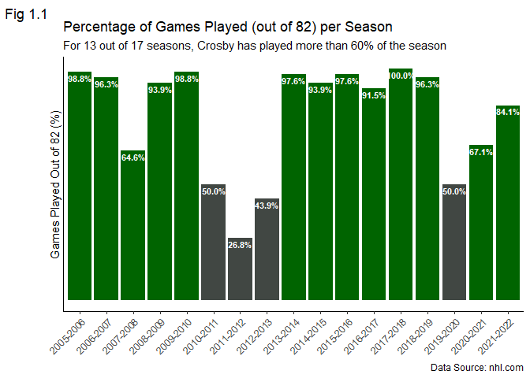
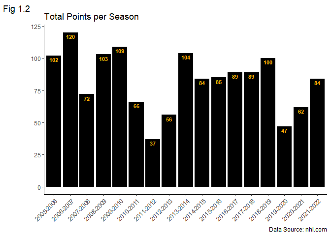
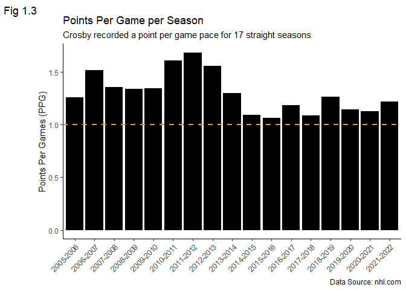
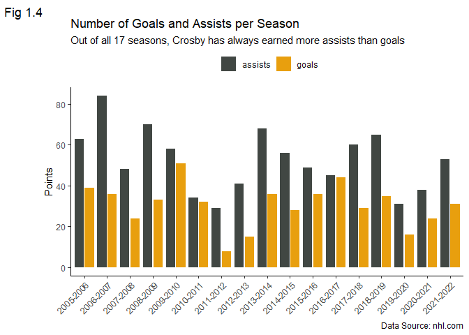
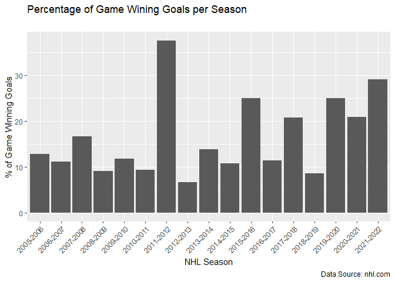

Data Analysis of Sidney Crosby’s NHL Career (2005-Present)
================
Saheba Tegally
2022-09-03

## Introduction

This is an exploratory data analysis project of Sidney Crosby’s NHL
career starting 2005 to the latest 2021-2022 NHL season.

### Who is Sidney Crosby?

Sidney Crosby is a Canadian ice hockey player who plays Centre in the
National Hockey League (NHL) and the Captain of the Pittsburgh Penguins.
Born in Cole Harbour, Nova Scotia, Canada, he was drafted First overall
in the 2005 NHL Entry Draft by the Pittsburgh Penguins with a lot of
hype around him as “The Next One”. He has many achievements and
accolades to his name. Most notably, he is a three times NHL Stanley Cup
Champion and two times Olympic Gold Winner.

### Why I chose Sidney Crosby?

Sidney Crosby is the player that got me hooked onto hockey. My first
memorable hockey moment is when I was following the 2010 Vancouver
Winter Olympics and watched Sidney Crosby live on TV scoring the goal in
overtime that won Team Canada Gold for Men Hockey.

### What to expect

We will look at his overall performance throughout the 17 regular
seasons he has played in the NHL so far. We will not look at his
performance in the NHL Playoffs due to the complexity of the playoffs
and taking into consideration that there are years when the Pittsburgh
Penguins either missed the playoffs (albeit rare) or did not make it far
into the playoffs.

Sufficient information about the NHL and hockey statistics will be
provided as needed throughout the notebook. This way even people who are
not familiar or as knowledgeable with hockey can still easily follow
along. I acknowledge that although I have a good understanding and
familiarity of the game, I am still not an expert and do not know every
aspect of it. To keep things as fair and accurate as possible, I will
only use the metrics that I have a good understanding of. Also, I
acknowledge that while the data and tools I will be using can reveal a
lot of things, it does not give the complete picture.

### Goal of this project

The goal of this project is to look at Sidney Crosby’s NHL career solely
through the lens of data. There are many other great hockey players out
there and the point of this project is not to argue or emphasize the
greatness of Sidney Crosby over other players. Thus, no comparison of
Sidney Crosby to any specific player will be made.

``` r
library(dplyr)
library(tidyr)
library(ggplot2)
library(lubridate)
library(stringr)
library(rmarkdown)
library(here)
```

``` r
# get the working directory of this R project
directory <- here()
games_reg = read.csv(file = paste0(directory,"/data/games_regular.csv"), header = TRUE)
```

``` r
nhl_games_reg <- games_reg %>% 
                 # only look at games played in NHL
                 filter(team.name == "Pittsburgh Penguins") %>%
                 # select all statistics related to NHL games
                 select(season:plusMinus) %>%
                 # use only the year the season begins in for season to allow plotting flexibility
                 # change season column from character to Date format
                 mutate(season = paste(str_sub(season,1,4), str_sub(season,5,-1), sep = '-'))
```

## Analysis

The first thing we are going to look at is the number of games played by
the player. There are 82 games in an NHL season and each Win counts as 2
points and an Overtime Loss counts as 1 point. The NHL is made up of the
Eastern and Western Conference and each Conference is made up of 2
divisions. The Pittsburgh Penguins is part of the Metropolitan division
in the Eastern Conference. For decades, the Eastern conference has been
stronger and more competitive compared to its counterpart. Therefore,
roughly 100 points, i.e. at least 50 Wins (ignoring Overtime losses) are
needed to secure a playoff spot. Injuries are a common occurrence in the
NHL with some players more injury prone than others. Thus, with the goal
of making the playoffs a player needs to play at least `r(50/82)*100`%
of the season to make a meaningful impact on the team.

``` r
nhl_games_reg %>%
  mutate(GamesPlayedPct = games/82) %>%
  mutate(cond = dplyr::case_when(GamesPlayedPct >= 50/82 ~ "darkgreen",
                                        TRUE ~ '#414743')) %>%
  ggplot(aes(x = season, 
             y = GamesPlayedPct,
             label = scales::percent(GamesPlayedPct),
             fill = cond)) +
  geom_col() +
  scale_fill_identity() +
  geom_text(nudge_y = -0.025,
            color = "white",
            size = 3,
            fontface = "bold") +
  scale_y_continuous(labels = NULL, breaks = NULL) +
  guides(x = guide_axis(angle = 45)) +
  labs(x = NULL,
       y = "Games Played Out of 82 (%)",
       title = "Percentage of Games Played (out of 82) per Season",
       subtitle = "For 13 out of 17 seasons, Crosby has played more than 60% of the season",
       caption = "Data Source: nhl.com",
       tag = "Fig 1.1") +
  theme_classic()
```

<!-- --> The
plot above shows that Sidney Crosby’s NHL career has been quite injury
riddled. Out of 17 seasons, he has played all 82 games only once during
the 2017-2018 NHL season. However, out of 17 seasons so far he has
played more than 50 games for 13 of them. Of those 13 seasons, the plot
above shows that he has actually played more than 90% of the season for
10 of them. That means, despite his injuries he has been mostly
available to play and make an impact on the team.

The next thing we are going to look at is the player’s points
production. Hockey players get points for equally scoring a goal or
getting an assist on the play that lead to a goal. A player can have a
‘lucky’ season and put up a lot of points. Good players on the other
hand produce a lot of points consistently on a regular basis.

``` r
nhl_games_reg %>%
  ggplot(aes(x = season, y = points, fill = "black", label = points)) +
  geom_col() +
  scale_fill_identity() +
  geom_text(nudge_y = -3,
            color = "#ffb303",
            size = 3,
            fontface = "bold") +
  guides(x = guide_axis(angle = 45)) +
  labs(x = NULL, 
       y = NULL,
       title = "Total Points per Season",
       caption = "Data Source: nhl.com",
       tag = "Fig 1.2") +
  theme_classic()
```

<!-- --> Not
surprisingly, We can see that the plot above in Figure 1.2 looks
strikingly similar to the plot in Figure 1.1. The total number of points
Crosby earned by the end of each season is reflected by the number of
games he managed to play. An interesting observation is despite playing
all 82 games in the 2017-2018 season, he had the same number of total
points as the previous season and less points than the next season where
he played less games in both.

For assessing a player’s performance, the number of points scored per
game pace is a better metric to use than the total points accumulated at
the end of each season. It gives a more clear and accurate idea of the
player’s productivity and consistency as it takes the number of games
played into consideration which is what we are going to look at next.

``` r
ggplot(data = nhl_games_reg) + 
  geom_col(aes(x = season, y = points/games, fill = "black")) +
  geom_hline(yintercept = 1, 
             linetype = "dashed", 
             size = 1, 
             color = "#e89f0e") +
  scale_fill_identity() +
  guides(x = guide_axis(angle = 45)) +
  labs(x = NULL,
       y = "Points Per Games (PPG)",
       title = "Points Per Game per Season",
       subtitle = "Crosby recorded a point per game pace for 17 straight seasons",
       caption = "Data Source: nhl.com",
       tag = "Fig 1.3") +
  theme_classic()
```

<!-- -->
Sidney Crosby has recorded at least a point per game for 17 straight
seasons. This is the current longest active streak in the NHL (longest
among current active players) and the second longest streak in NHL
history. This is a tremendous accomplishment and proof that he is still
a very productive player despite his injuries.

``` r
nhl_games_reg %>%
  rename(total_points = points) %>%
  pivot_longer(c("goals","assists"),
                      names_to = "point_from",
                      values_to = "points") %>%
  ggplot(aes(x = season, y = points, fill = as.factor(point_from))) +
  geom_bar(position = position_dodge2(), stat = "identity") +
  scale_fill_manual(values = c('#414743',"#e89f0e"),
                    name = element_blank()) +
  guides(x = guide_axis(angle = 45)) +
  labs(x = NULL,
       y = "Points",
       title = "Number of Goals and Assists per Season",
       subtitle = "Out of all 17 seasons, Crosby has always earned more assists than goals",
       caption = "Data Source: nhl.com",
       tag = "Fig 1.4") +
  theme_classic() +
  theme(legend.position = "top")
```

<!-- -->

``` r
ggplot(data = nhl_games_reg) +
  geom_col(mapping = aes(x = season, y = faceOffPct)) +
  labs(title = "FaceOff Percentage per Season",
       x = "NHL Season",
       y = "FaceOff Percentage %") + 
  guides(x = guide_axis(angle = 45)) +
  theme_classic()
```


In Hockey, a player’s Shooting Percentage is the percentage of their
attempted shots that resulted in goals. For this calculation, a goal is
any shot that sent the puck into the net, including empty net goals but
not goals from a shootout. A shot attempt is any action that directs the
puck towards the net, however shots blocked by a non-goalie player,
shots that missed the net or hit the goal post, or shots in a shootout
are not included.

``` r
ggplot(data = nhl_games_reg) +
  geom_col(mapping = aes(x = season, y = shotPct)) +
  labs(title = "Shot Percentage per Regular Season",
       x = "NHL Season",
       y = "Shot Percentage %") + 
  guides(x = guide_axis(angle = 45)) +
  theme_classic()
```

<!-- -->

Scoring goals for the team is always nice, but scoring them during key
moments is even more crucial. Such as when victory is at stake. In the
NHL, a goal is considered the game winning goal when the team would win
the game without scoring any more goals. Let’s take a look at how many
game winning goals Sidney Crosby has.

``` r
ggplot(data = nhl_games_reg) +
  geom_col(aes(x = season, y = (gameWinningGoals/goals)*100)) +
  guides(x = guide_axis(angle = 45)) +
  labs(x = "NHL Season",
       y = "% of Game Winning Goals",
       title = "Percentage of Game Wining Goals per Season",
       subtitle = "",
       caption = "Data Source: nhl.com")
```

<!-- -->

## Conclusion
